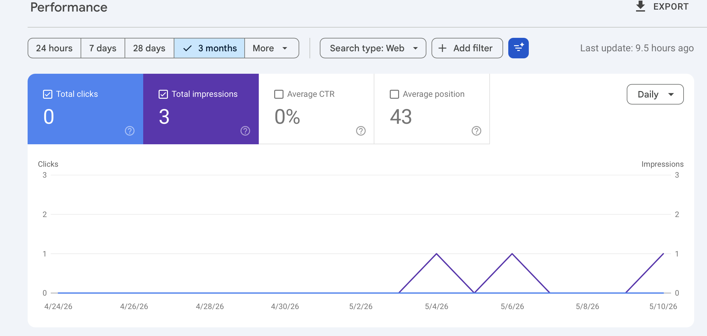

## Performance report

My portfolio website is connected to Google Search Console to monitor its visibility in Google Search. The Performance report tracks total clicks, total impressions, average click-through rate, and average search position over time.

As seen in the Performance report above, from April 24 to May 12, my portfolio website began appearing in Google Search results, receiving 3 impressions with an average search position of 43. Since the website is still fairly new, this report provides an early glimpse of the site’s current search visibility.